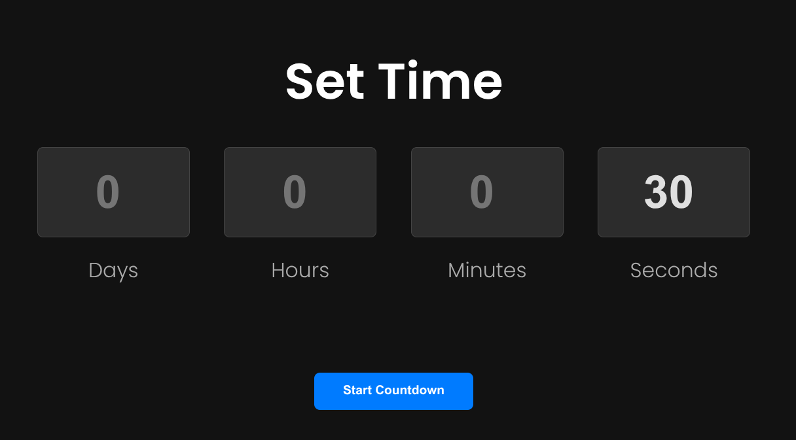
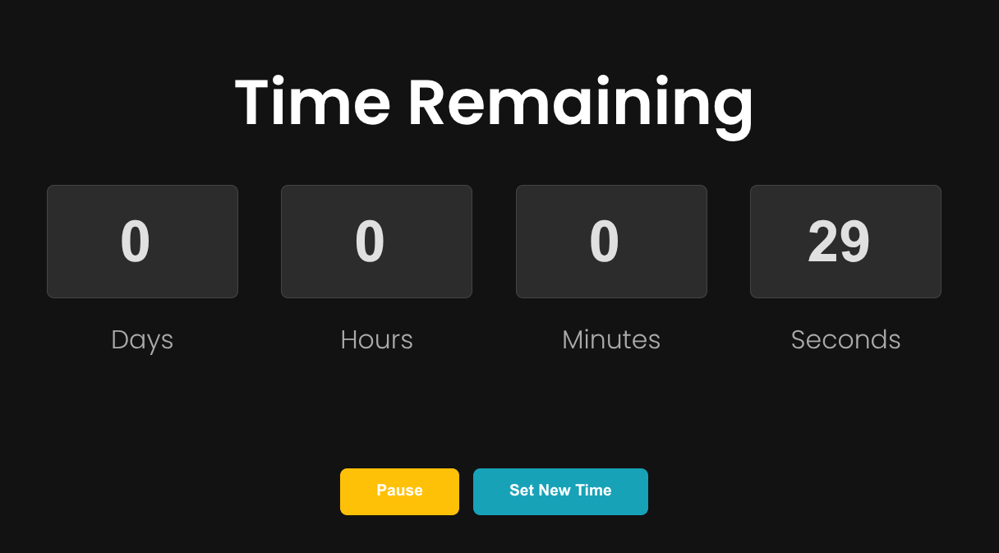
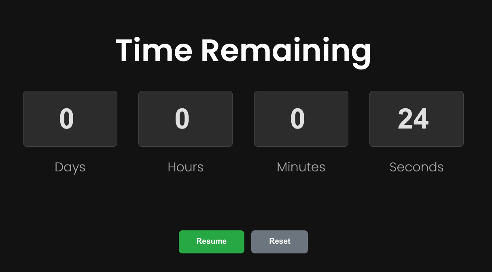

# ⏳ Countdown Timer ⌛

A simple JavaScript project that allows users to set a date and time, then displays a live countdown in **days, hours, minutes, and seconds**.  
When the countdown reaches zero, a final message appears on the screen.

---

## 🚀 Features

- Set any **future date and time** for the countdown
- Live updating timer with:
  - Days
  - Hours
  - Minutes
  - Seconds
- Final message displayed when the countdown ends
- Clean, minimal, and modern UI design

---

---

---

